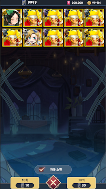

<h1>메탈슬러그 키우기</h1>
메탈슬러그 키우기는 "세븐나이츠 키우기"를 모작한 2.5D 모바일 방치형 게임입니다. 
이 프로젝트는 "메탈슬러그 어택"의 리소스를 활용하여, 메탈슬러그 시리즈 특유의 감성을 모바일 방치형 RPG로 재현하는 데 중점을 두었습니다.

## 스크린샷

|  |  |  |
|:---:|:---:|:---:|
| 로그인 화면 | 메인 화면 | 영웅 목록 |

|  |  |  |
|:---:|:---:|:---:|
| 영웅 편성 | 채팅 시스템 | 영웅 소환 |

## 목차
  - [개요](#개요) 
  - [개발 환경](#개발-환경)
  - [링크](#링크)
  - [구현한 컨텐츠](#구현한-컨텐츠)

## 개요
- **개발 기간:** 2024.06.18 ~ 2024.07.10(약 3주)
- **프로젝트 유형:** 개인 프로젝트

## 개발 환경
- **개발 엔진 및 언어:** Unity 2021.3.36f1 LTS, C#
- **IDE:** Jetbrains Rider

## 링크
- **포트폴리오:** https://drive.google.com/file/d/1Sfp-aORbx_XO3rHulpWKgS1q89Swcoe5/view?usp=drive_link
- **시연 영상:** https://youtu.be/1swO0w7Lbqc

## 구현한 콘텐츠

### 사용자 인증 및 로그인
- Google Play Games 및 Firebase Authentication을 통한 사용자 로그인 및 인증 시스템 구현
- 이메일 및 Google 계정으로 로그인 가능, 자동 로그인 지원

### 가챠(영웅 소환) 시스템
- Firebase Functions와 Node.js 기반의 가중치 랜덤 알고리즘을 사용해 영웅 소환 시스템 구현
- 소환된 영웅 데이터는 Firebase Realtime Database에 저장되고, 게임 내 UI에 동적으로 반영

### 채팅 시스템
- TCP/IP 기반의 채팅 서버와 클라이언트 간의 실시간 메시지 송수신 구현

### 영웅 관리 및 파티 시스템
- 영웅의 상태와 행동을 상태 패턴을 통해 관리
- 파티 편성 시스템을 통해 최대 5명의 영웅으로 팀을 구성하고 전투를 진행
- 필터링 기능을 통해 다양한 기준으로 영웅 정렬 및 검색 가능

### 데이터 관리 및 이벤트 시스템
- Firebase Realtime Database와 연동하여 사용자 데이터를 저장하고 불러오는 기능 구현
- EventManager를 통해 이벤트를 관리하고 이벤트 기반으로 UI 및 게임 상태를 동기화

### 이벤트 주도적 프로그래밍(Event Driven Programming)
- 전역에서 접근 가능한 EventManager를 통해 이벤트를 관리하고, 이벤트 기반으로 UI 및 게임 상태를 동기화